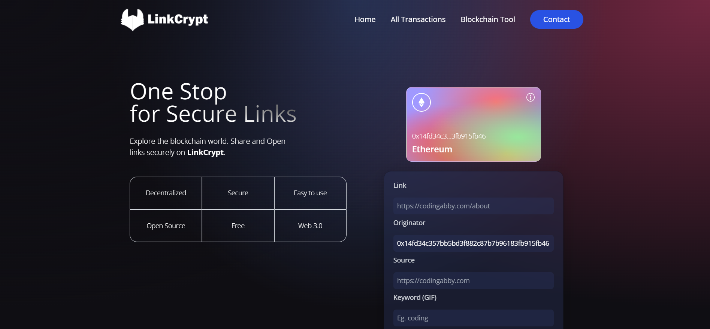
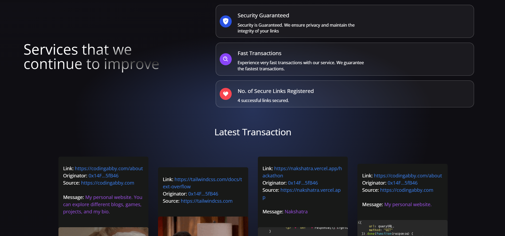
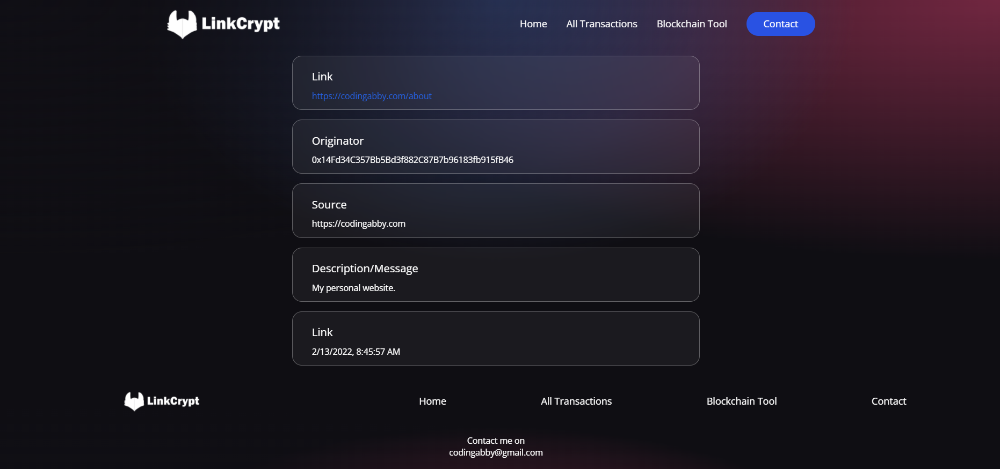
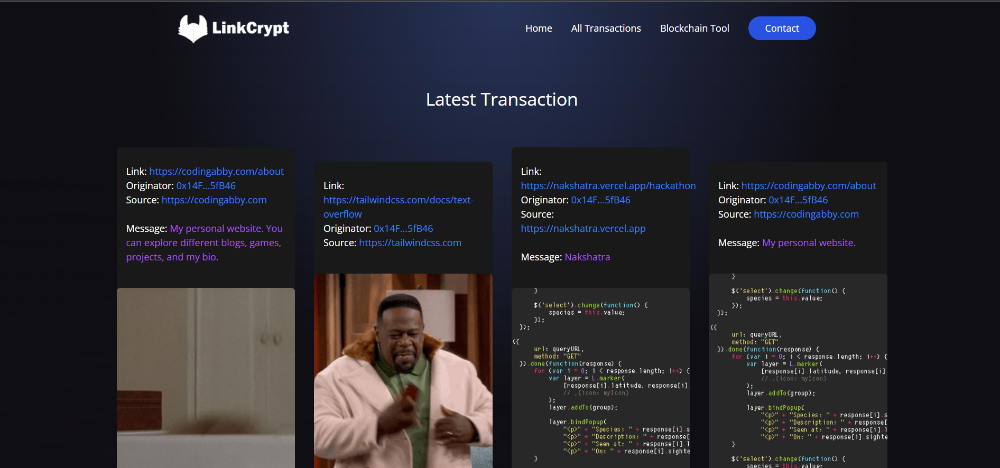

# LinkCrypt
> One-Stop Solution for Securing Links
> We are literally flooded with links in our daily life. The authenticity and the origin of many links are not known to us. Some websites might contain malicious activities or they may be phishing websites. This hack enables the link-sharing entities to provide a security assurance by providing some metadata related to the URL and it's content. All this metadata is stored in the blockchain making it immutable and also allowing link openers to validate the originality of the URL.

 
## Screenshots

## Features

* Blockchain stores all the metadata related to a link to be validated
* The users can easily authenticate with their Metamask wallet
* All the transactions(links minted) are displayed on the website
* No. of total links secured are also shown
* Each link is associated with a GIF since visual representation/effect is always better.
* Tailwind CSS makes it 100% responsive

## Installation

A step by step list of commands / guide that informs how to install an instance of this project. 

`$ cd client`

`$ npm install`

`$ cd ..`

`$ cd smart_contract`

`$ npm install`

`$ ../client> npm run dev`

## Tech Stack / Built With

0. Web 3.0
1. Blockchain
2. Ethereum
3. React JS
4. Tailwind CSS
5. Hardhat

## Authors
 
Abhay Ubhale  – abhayubhale.30@gmail.com
 
You can find me here at:
[Github](https://github.com/abby3010)
[LinkedIn](https://www.linkedin.com/in/abhay-ubhale)